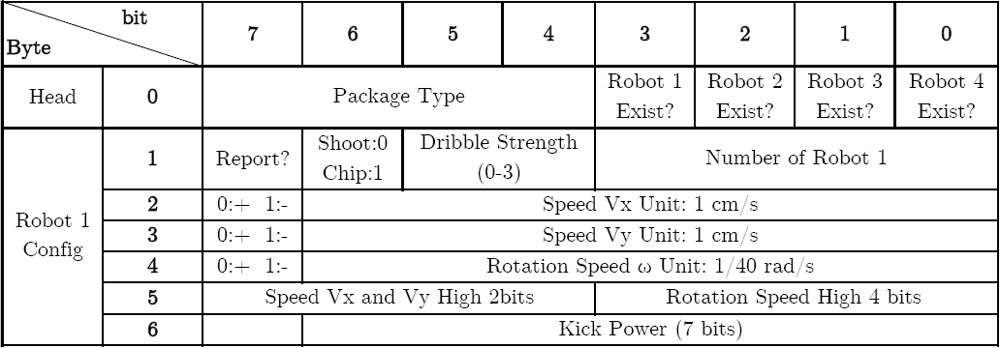

# Wireless_Communication_Protocol

ZJUNlict Wireless Communication Protocol for the Robocup Soccer Small-Size League https://zjunlict.cn/

The communication quality becomes a pressing problem when the competition requires a larger field and more robots. For a typical nRF24L01+ wireless package (maximum 32 bytes) consists of 5 bytes receiver address, 2 bytes CRC and 25 bytes user payload. Compared with other teams' communication protocol which often requires one package for each robot, our communication protocol shown in the figure below significantly reduces the package amount required in each control period. Apart from 1 byte package header indicates the package type and robot existence in each package, each robot takes up to 6 bytes for the velocity, dribbler and kick command. For 25 bytes user payload, each package is able to control up to 4 robots. For current 11 robots, 3 packages per control period are enough which uses total 96 bytes (bandwidth as low as 250kbits/s is quite enough (250kbits/s == 250bits/s == 500 bytes / 16ms)). The bandwidth of nRF24L01+ can also be set to 1Mbits/s and 250kbits/s which requires fewer frequency bandwidth. By reducing the communication traffic in each control period and frequency bandwidth both reduces the possibility of radio interference.

